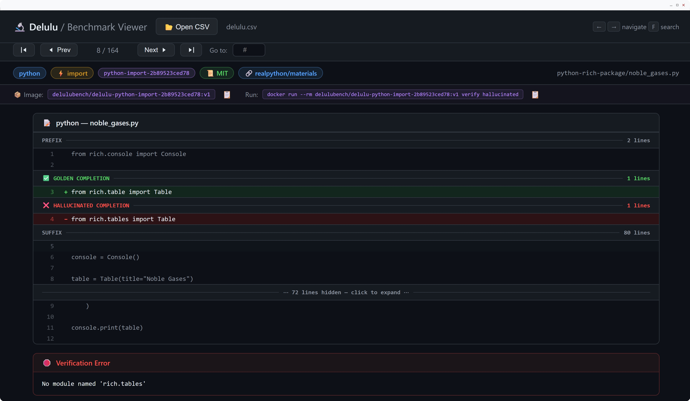

<h1 align="center">Delulu</h1>

<p align="center">
  <strong>A verified multilingual benchmark for code-completion hallucinations.</strong><br>
  Every sample runs. Every hallucination is provably wrong.
</p>

<p align="center">
  
  
  
  <a href="LICENSE"></a>
  <a href="https://huggingface.co/datasets/microsoft/delulu-fim-benchmark"></a>
</p>

<p align="center">
  
</p>

<p align="center">
  <em>Every Delulu sample ships as a self-contained Docker image. The viewer above lets you browse the dataset, pull a sample's verifier, and re-run <code>verify golden</code> / <code>verify hallucinated</code> / <code>verify patch &lt;your-completion&gt;</code> with one click — so every score on Delulu is execution-grounded.</em>
</p>

---

## Why Delulu?

Modern code LLMs hallucinate confidently: they invent functions that don't
exist, pass parameters the API never accepted, and import modules nobody
wrote. Most "hallucination" benchmarks score this with a textual judge — but
plausible-looking code is exactly what these models are good at, so judges
disagree and scores drift.

**Delulu grounds every label in execution.** For each Fill-in-the-Middle
context we ship:

- a **golden** completion that compiles and passes the original repository's
  tests, and
- a **hallucinated** completion that *looks* plausible but provably fails —
  the symbol doesn't exist, the method signature is wrong, the import
  resolves to nothing.

Both completions are verified inside a per-sample Docker image. If a model's
output runs, it runs against the same harness the labels did.

## Highlights

- 🧪 **Execution-grounded.** Every hallucination has a reproducible failure
  trace inside its own Docker image.
- 🌍 **7 languages, 1 schema.** C++, C#, Go, Java, TypeScript, Python, Rust —
  unified `prefix` / `suffix` / `golden` / `hallucinated` columns.
- 🔬 **Real repos, real APIs.** Samples are mined from permissively licensed
  GitHub projects, with `license` and `repo_url` recorded per row.
- 🧰 **Two evaluation modes out of the box** — an LLM-as-judge harness and an
  execution-based pass@1 + offline-metrics runner.
- 🖥️ **Browsable viewer.** A local UI (also a Docker image) shows the diff,
  the verifier error trace, and lets you re-run any patch live.
- 📦 **One row, one image.** No flaky environment setup — the verifier
  carries its own toolchain.

## Stats

<div align="center">

| Languages | Samples | Unique FIM contexts | Hallucination types |
| :---: | :---: | :---: | :---: |
| C++, C#, Go, Java, TypeScript, Python, Rust | **1,947** | 947 | `import`, `method`, `parameter`, `undefinedvariable` |

</div>

<table align="center">
<tr>
<td valign="top">

| Language    | Count |
| ----------- | ----: |
| TypeScript  |   420 |
| Python      |   370 |
| Go          |   291 |
| Rust        |   252 |
| C#          |   246 |
| Java        |   243 |
| C++         |   125 |

</td>
<td valign="top">

| Hallucination type   | Count |
| -------------------- | ----: |
| `undefinedvariable`  |   576 |
| `import`             |   476 |
| `method`             |   460 |
| `parameter`          |   435 |

</td>
</tr>
</table>

## Quickstart

```python
from tools.load import load_delulu
df = load_delulu()
print(df.shape, df["language"].value_counts())
```

Or pull it straight from the Hub:

```python
from datasets import load_dataset
ds = load_dataset("microsoft/delulu-fim-benchmark", split="test")
```

For an end-to-end 5-minute walkthrough on a 14-sample mini set, see
[examples/quickstart.md](examples/quickstart.md).

## The two evaluation tools

### 1. Judge — *Can a foundation model tell which completion is hallucinated?*

`evaluations/run_delulu_judges.py` shows a judge model the prefix, suffix,
and a candidate completion, asks it to score `0` or `1`, and counts a sample
as correct only when the judge scores **golden=1** AND **hallucinated=0**.

```bash
cp .env.example .env
pip install -e ".[eval]"
python evaluations/run_delulu_judges.py --models GPT-5.5 Claude-4.5-Sonnet
```

Per-model caches are written under `evaluations/results/`, so runs are
resumable. See [evaluations/README.md](evaluations/README.md).

### 2. Metrics — *Do the model's completions actually run? How close are they to the truth?*

`evaluations/run_completion_metrics.py` takes a CSV of model predictions
(columns: `benchmark_id`, `model_completion`) and computes:

- **pass@1** — execution-based, by piping each completion into the
  per-sample Docker verifier image (`docker run -i <image> verify patch`).
- **exact_match** — strict equality with the golden completion.
- **edit_similarity** — char-level normalised Levenshtein vs. golden.
- **hallucination_rate** — share of completions closer to the *hallucinated*
  variant than to the golden one.

```bash
# Fast smoke-test: 2 samples per language (14 total)
python evaluations/run_completion_metrics.py \
    --predictions my_model.csv \
    --model-name my-model \
    --smoke-test

# Full run
python evaluations/run_completion_metrics.py \
    --predictions my_model.csv \
    --model-name my-model
```

Verifier images are pulled from `${DELULU_REGISTRY}` (defaults to a
pre-release registry; the public Docker Hub mirror is TBA).

## Viewer

A browsable UI for the dataset is shipped as a Docker image — see
[tools/viewer/README.md](tools/viewer/README.md):

```bash
docker run --rm -p 127.0.0.1:8000:8000 \
    -v /var/run/docker.sock:/var/run/docker.sock \
    delulubench/delulu-viewer:v1
```

The viewer is what's shown in the screenshot at the top.

## What's in the repo

```
data/                # delulu.csv + datasheet
tools/
  load.py / stats.py / slice.py / show.py    # CLIs for working with the dataset
  viewer/                                    # browser UI (also a Docker image)
evaluations/
  run_delulu_judges.py        # LLM-as-judge harness (the "judge" tool)
  run_completion_metrics.py   # pass@1 + offline metrics (the "metrics" tool)
examples/            # 5-minute walkthrough on a 14-sample mini set
```

## Citation

```bibtex
@misc{delulu2026,
  title  = {Delulu: A Verified Multi-Lingual Benchmark for Code Hallucination Detection in Fill-in-the-Middle Tasks},
  author = {Erfanian, Mahdi and Troncoso, Nelson Daniel and Garg, Aashna and Gale, Amabel and Liu, Xiaoyu and Golnari, Pareesa Ameneh and Fu, Shengyu},
  year   = {2026},
  url    = {https://github.com/microsoft/delulu}
}
```

A machine-readable citation is in [CITATION.cff](CITATION.cff).

## License

- **Code** in this repository: MIT (see [LICENSE](LICENSE)).
- **Data**: each sample inherits the license of its source repository,
  recorded in the `license` and `repo_url` columns. See
  [DATA_LICENSE.md](DATA_LICENSE.md).

## Links

- Paper (arXiv): _TBA_
- Hugging Face dataset: <https://huggingface.co/datasets/microsoft/delulu-fim-benchmark>
- Docker Hub: _TBA_
